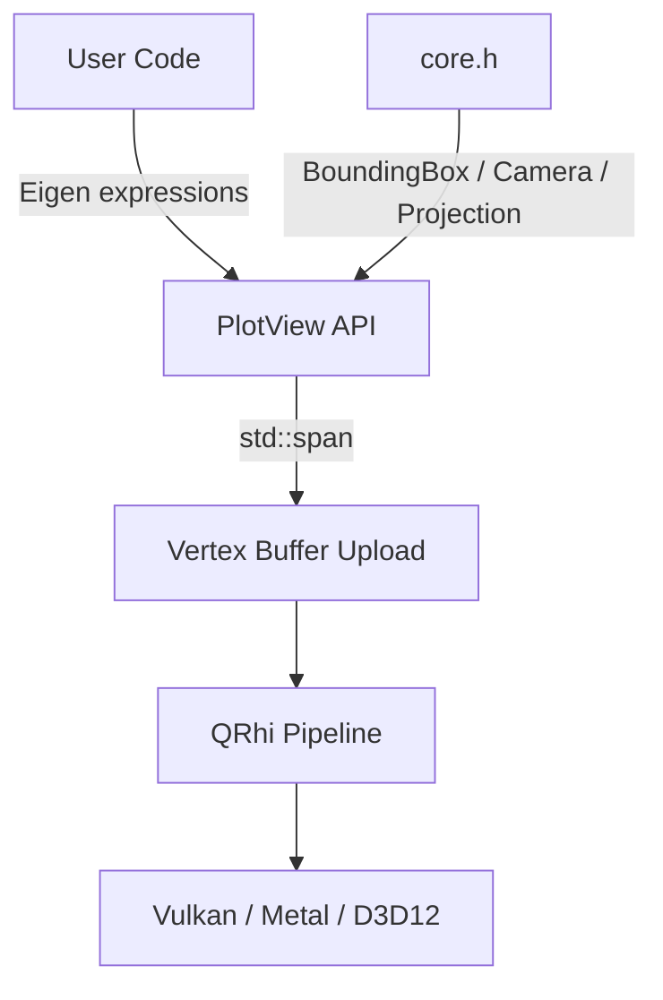

# SkigenPlot

Hardware-accelerated C++ plotting for the scientific and ML ecosystem — *matplotlib for C++*, but built on Vulkan/Metal/Direct3D from day one.

## Why SkigenPlot?

- **Zero-friction Eigen integration** — pass any `Eigen::MatrixBase<Derived>` expression directly; no manual conversion.
- **Real-time capable** — dynamic vertex buffers and QRhi rendering sustain 60 Hz+ at 1M+ data points.
- **LGPLv3/MIT safe** — no QPainter, no Canvas; all rendering through `QRhiWidget` with raw GPU commands.
- **Cross-platform GPU** — Vulkan (Linux), Metal (macOS/iOS), Direct3D 12 (Windows) via Qt's RHI abstraction.

## Quick Example

```cpp
#include <skigen/plot/plotview.h>
#include <Eigen/Core>
#include <QApplication>
#include <numbers>

int main(int argc, char* argv[]) {
    QApplication app(argc, argv);

    Eigen::VectorXf x = Eigen::VectorXf::LinSpaced(500, 0.f,
        4.f * std::numbers::pi_v<float>);
    Eigen::VectorXf y = x.array().sin();

    Skigen::Plot::PlotView view;
    view.plot(x, y);
    view.show();

    return app.exec();
}
```

## Architecture



## Supported Plot Types

| Type | Dimension | Status |
|------|-----------|--------|
| Line plot | 2D | v1.0.0 |
| Scatter plot | 2D | v1.0.0 |
| Scrolling telemetry | 2D | v1.0.0 |
| Point cloud | 3D | v1.0.0 |
| Surface mesh | 3D | v1.0.0 |

## Dependencies

| Library | Version | Purpose |
|---------|---------|---------|
| Eigen 3 | ≥ 3.4 | Matrix/vector types |
| Qt 6 | ≥ 6.7 | Widgets + QRhi rendering |
| C++ | 23 | `std::span`, `std::expected`, `std::ranges` |
